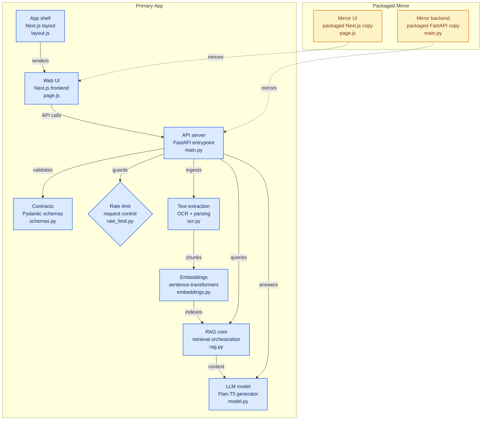

# DocMeant: Local Neural Document Intelligence

**DocMeant** is a high-performance, private, and local RAG system designed for deep document analysis. It runs entirely on your local hardware (optimized for NVIDIA GPUs) ensuring that no sensitive data ever leaves your machine.


### Key Features
- **Neural Query Console**: Natural language interface to ask complex questions across 50+ page documents.
- **Autonomous Document Scan**: Deep neural identification of metadata, topics, and subjects.(Little buggy, PR the fix if u can).
- **Entity Target Extraction**: Specify target fields for high-precision data extraction.(and this one is buggy too :)
- **Local Neural VRAM**: Fully GPU-accelerated (FP16) using your local RTX hardware.(My laptop was burning)
- **Offline First**: Zero cloud dependencies. Works completely offline using local weights.

##  Tech Stack
- **Frontend**: Next.js (React), Vanilla CSS (Noir System)
- **Backend**: FastAPI (Python 3.11)
- **Neural Brain**: 
  - **Generation**: Google Flan-T5-Large (770M)
  - **Embeddings**: Sentence-Transformers (all-MiniLM-L6-v2)
- **Vector Store**: FAISS (Facebook AI Similarity Search)
- **Extraction**: PyMuPDF (fitz) & Parallel OCR (Tesseract)

##  Quick Start

### 1. Prerequisites
- **Python 3.11+**
- **Node.js 18+**
- **NVIDIA GPU** (RTX 30 series or higher recommended)
- **CUDA 12.1** installed

### 2. Backend Setup
```bash
# Navigate to backend
cd backend
# Create and activate venv
python -m venv venv
./venv/Scripts/activate
# Install optimized dependencies
pip install torch torchvision torchaudio --index-url https://download.pytorch.org/whl/cu121
pip install -r requirements.txt
# Start the engine
uvicorn main:app --port 8000
```

### 3. Frontend Setup
```bash
# Navigate to web
cd web
# Install dependencies
npm install
# Start the noir interface
npm run dev
```

## Privacy & Security
DocMeant is built with a "Privacy by Design" philosophy. All neural processing, embedding generation, and vector storage happen locally in your VRAM and filesystem. 

## License
Distributed under the MIT License. See `LICENSE` for more information.

---
Built by [park-bit](https://github.com/park-bit) ; [support](https://www.chai4.me/park-bit)
